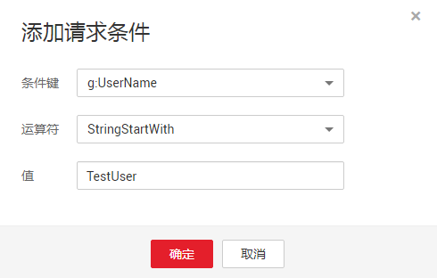
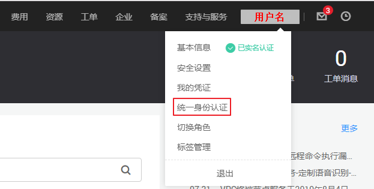
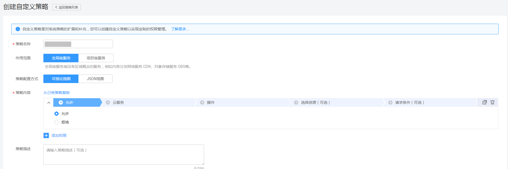

# 创建自定义策略

如果系统策略不满足授权要求，管理员可以创建自定义策略，并通过给用户组授予自定义策略来进行精细的访问控制，自定义策略是对系统策略的扩展和补充。

目前华为云支持以下两种方式创建自定义策略：

-   可视化视图：通过可视化视图创建自定义策略，无需了解JSON语法，按可视化视图导航栏选择云服务、操作、资源、条件等策略内容，可自动生成策略。
-   JSON视图：通过JSON视图创建自定义策略，可以在选择策略模板后，根据具体需求编辑策略内容；也可以直接在编辑框内编写JSON格式的策略内容。

## 前提条件

请确保已[开通细粒度授权功能](申请细粒度访问控制公测.md)，开通细粒度策略后，才能创建自定义策略。

## 可视化视图配置自定义策略

1.  登录华为云，在右上角单击“控制台”。
2.  在控制台页面，鼠标移动至右上方的用户名，在下拉列表中选择“统一身份认证”。

    

3.  在左侧导航窗格中，单击“策略”\>“创建自定义策略“。

    **图 1**  IAM控制台  
    

    **图 2**  创建自定义策略  
    

4.  输入“策略名称“。
5.  选择“作用范围“，即自定义策略的生效范围，根据服务的部署区域选择，详情请参考：[权限策略](https://support.huaweicloud.com/usermanual-permissions/zh-cn_topic_0063498930.html)。

    -   全局级服务：权限策略中该服务的“所属区域”为“全局区域”，表示该服务为全局级服务。创建全局级服务的自定义策略时，作用范围选择“全局级服务”。给用户组授予该自定义策略时，需要在全局区域中进行。
    -   项目级服务：权限策略中该服务的“所属区域”为“除全局区域外其他区域”，表示该服务为项目级服务。创建项目级服务的自定义策略时，作用范围选择“项目级服务”。给用户组授予该自定义策略时，需要在除全局区域外其他区域中进行。

    例如：创建EVS的自定义策略（"evs:volumes:create"），由于EVS服务属于项目级服务，作用范围必须选择项目级服务。

    > **说明：**   
    >如果一个自定义策略中包含多个服务的授权语句，这些服务必须是同一属性，即都是全局级服务或者项目级服务。如果需要同时设置全局服务和项目级服务的自定义策略，请创建两条自定义策略，“作用范围”分别为“全局级服务”以及“项目级服务”。  

6.  “策略配置方式“选择“可视化视图“。
7.  在“策略内容“下配置策略。
    1.  选择“允许“或“拒绝“。
    2.  选择“云服务“。

        > **说明：**   
        >此处只能选择一个云服务，如需配置多个云服务的自定义策略，请在完成此条配置后，单击“添加权限”，创建多个服务的授权语句；或使用[JSON视图配置自定义策略](#section194722218121)。  

    3.  选择“操作“，根据需求勾选产品权限。
    4.  选择资源类型，如选择“特定类型”可以点击“通过资源路径指定“来指定需要授权的资源。
    5.  （可选）添加条件，单击“添加条件“，选择“条件键“，选择“运算符“，根据运算符类型填写相应的值。

        **表 1**  条件参数

        
        <table><thead align="left"><tr id="row5234843202"><th class="cellrowborder" valign="top" width="16.07%" id="mcps1.2.3.1.1">
参数名称

        </th>
        <th class="cellrowborder" valign="top" width="83.93%" id="mcps1.2.3.1.2">
参数说明

        </th>
        </tr>
        </thead>
        <tbody><tr id="row1023512410207"><td class="cellrowborder" valign="top" width="16.07%" headers="mcps1.2.3.1.1 ">
条件键

        </td>
        <td class="cellrowborder" valign="top" width="83.93%" headers="mcps1.2.3.1.2 ">
条件键表示策略语句的 Condition 元素中的键值。分为全局条件键和服务级条件键。全局级条件键（前缀为g:）适用于所有操作，服务级条件键（前缀为服务缩写，如obs:）仅适用于对应服务的操作。

        </td>
        </tr>
        <tr id="row1123514182018"><td class="cellrowborder" valign="top" width="16.07%" headers="mcps1.2.3.1.1 ">
运算符

        </td>
        <td class="cellrowborder" valign="top" width="83.93%" headers="mcps1.2.3.1.2 ">
与条件键一起使用，构成完整的条件判断语句。

        </td>
        </tr>
        <tr id="row3235134162018"><td class="cellrowborder" valign="top" width="16.07%" headers="mcps1.2.3.1.1 ">
值

        </td>
        <td class="cellrowborder" valign="top" width="83.93%" headers="mcps1.2.3.1.2 ">
与条件键和运算符一起使用，当运算符需要某个关键字时，需要输入关键字的值，构成完成的条件判断语句。

        </td>
        </tr>
        </tbody>
        </table>

        **图 3**  添加请求条件示例：  
        

        

          

8.  （可选）在“策略配置方式“选择JSON视图，将可视化视图配置的策略内容转换为JSON语句，您可以在JSON视图中对策略内容进行修改。

    > **说明：**   
    >如果您修改后的JSON语句有语法错误，将无法创建策略，可以自行检查修改内容或单击界面弹窗中的“重置”，将JSON文件恢复到未修改状态。  

9.  （可选）如需创建多条自定义策略，请单击“添加权限“；也可在已创建的策略最右端单击“+“，复制此权限。
10. 输入“策略描述“（可选）。
11. 单击“确定“，自定义策略创建完成。
12. 将新创建的自定义策略授予用户组，使得用户组中的用户具备自定义策略中的权限。

    > **说明：**   
    >给用户组授予自定义策略与系统策略操作一致，详情请参考：[创建用户组并授权](创建用户组并授权.md)。  

## JSON视图配置自定义策略

1.  登录华为云，在右上角单击“控制台”。

    

2.  在控制台页面，鼠标移动至右上方的用户名，在下拉列表中选择“统一身份认证”。

    

3.  在左侧导航窗格中，单击“策略”\>“创建自定义策略“。

    **图 4**  IAM控制台  
    

    **图 5**  创建自定义策略  
    

4.  输入“策略名称“。
5.  选择“作用范围“，即自定义策略的生效范围，根据服务的部署区域选择，详情请参考：[权限策略](https://support.huaweicloud.com/usermanual-permissions/zh-cn_topic_0063498930.html)。

    -   全局级服务：权限策略中该服务的“所属区域”为“全局区域”，表示该服务为全局级服务。创建全局级服务的自定义策略时，作用范围选择“全局级服务”。给用户组授予该自定义策略时，需要在全局区域中进行。
    -   项目级服务：权限策略中该服务的“所属区域”为“除全局区域外其他区域”，表示该服务为项目级服务。创建项目级服务的自定义策略时，作用范围选择“项目级服务”。给用户组授予该自定义策略时，需要在除全局区域外其他区域中进行。

    例如：创建EVS的自定义策略（"evs:volumes:create"），由于EVS服务属于项目级服务，作用范围必须选择项目级服务。

    > **说明：**   
    >如果一个自定义策略中包含多个服务的授权语句，这些服务必须是同一属性，即都是全局级服务或者项目级服务。如果需要同时设置全局服务和项目级服务的自定义策略，请创建两条自定义策略，“作用范围”分别为“全局级服务”以及“项目级服务”。  

6.  “策略配置方式“选择“JSON视图“。
7.  （可选）在“策略内容“区域，单击“从已有策略复制“，例如选择“VPC Admin“作为模板。
8.  单击“确定“。
9.  修改模板中策略授权语句。
    -   作用（Effect）：允许（Allow）和拒绝（Deny）。
    -   权限集（Action）：写入各服务API授权项列表（如[图1](#fig0791455333)所示）中“授权项“中的内容，例如："evs:volumes:create"，来实现细粒度授权。

        **图 6**  授权项示例  
        

        > **说明：**   
        >-   自定义策略版本号（Version）固定为1.1，不可修改。  
        >-   各服务支持的API授权列表，详情请参见：[权限策略](https://support.huaweicloud.com/usermanual-permissions/zh-cn_topic_0063498930.html)。  

10. （可选）输入“策略描述“。
11. 单击“确定”后，系统会自动校验语法，如跳转到策略列表，则自定义策略创建成功；如提示“策略内容错误”，请按照语法规范进行修改。
12. 将新创建的自定义策略授予用户组，使得用户组中的用户具备自定义策略中的权限。

    > **说明：**   
    >给用户组授予自定义策略与系统策略操作一致，详情请参考：[创建用户组并授权](创建用户组并授权.md)。  

